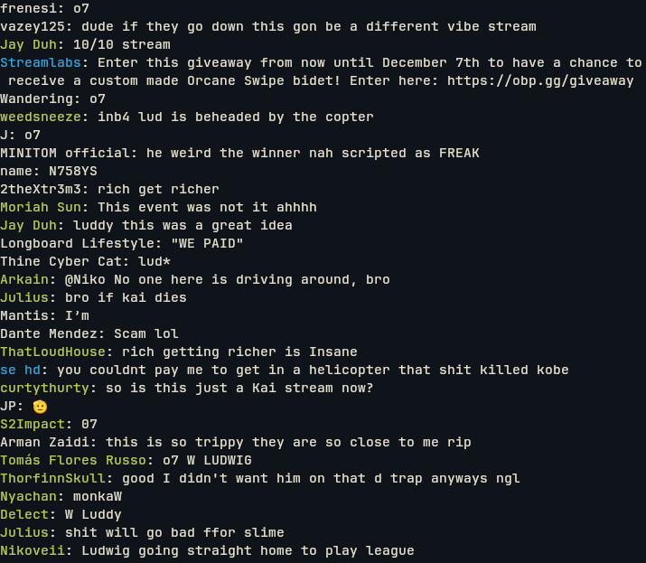

# YouTube Live Chat Terminal (ylct)

#### To view a YouTube streams chat messages in your terminal. 



## Dependencies 

- jq 
- bash
- curl
- Youtube v3 API key 

## Installation 

1. Obtain a YouTube V3 API by following the steps [here](https://developers.google.com/youtube/v3/getting-started)

2. Download the script `ylct.sh`

3. Export your API key as an environment variable by adding it to your bashrc or putting it in the script: 

#### Export to bashrc

```bash
echo 'export YT_API_KEY="your-api-key"' >> ~/.bashrc
source ~/.bashrc
```

#### or (more simply) add to ylct.sh

Modify the API_KEY line to have your API key: 

```bash
API_KEY="your-api-key"
```

3. Ensure the script is executable: 

```bash
chmod +x ylct.sh
```

## Usage 

Run the script with the input of the a live YouTuber's Channel Name. For instance: 

```bash
./ylct.sh "Ludwig"
```

## Issues 

- Sometimes if the Youtuber input is vaugue it could provide the wrong stream ID.

## Missing Features 

- Typing in chat 
- Youtube-specific emotes/GIFs

## Resource Used  

- [Request live chat messages](https://gist.github.com/w3cj/4f1fa02b26303ae1e0b1660f2349e705#3-request-live-chat-messages-using-this-activelivechatid)


